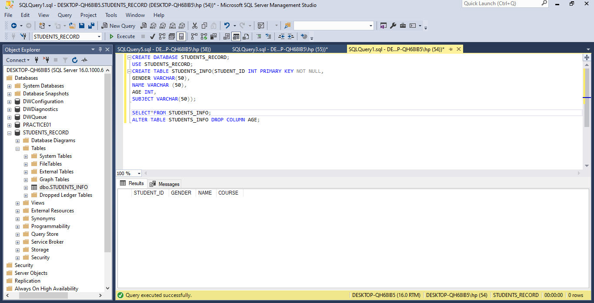
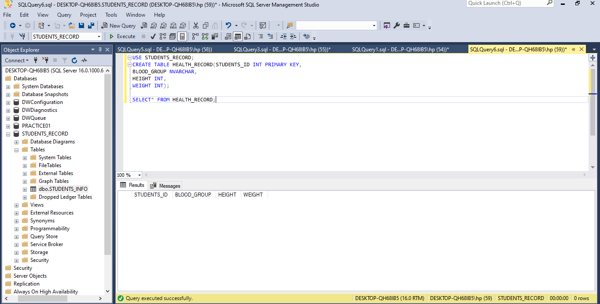
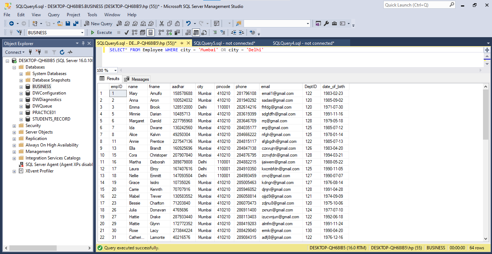
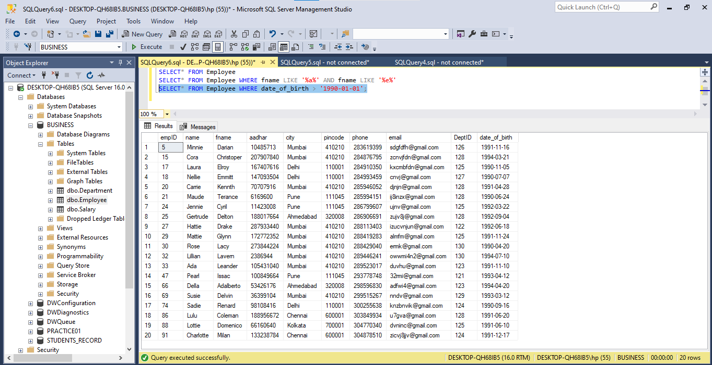
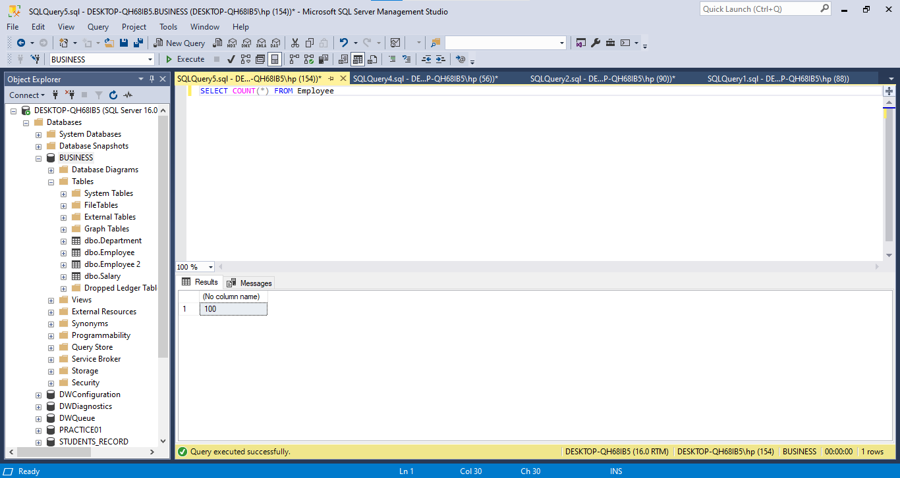
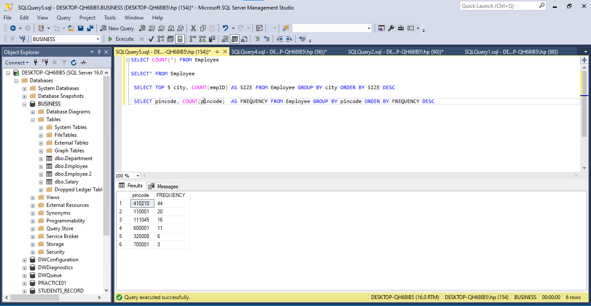

# SQL-TASKS
# TASK1 
•	Create a Database named “Students Record”
•	Create the following tables in the database create
- Students Info  (Student ID, Gender, Name, Age, Subject)
- Health records (Student ID, Blood Group, Height, Weight)
-	Performance (Student ID, Score, Grade)
•	The ID has to be unique
•	Where a student has no score, it should be ‘0’ by default
•	Add a constraint that prevents the ID and Subject from taking null values
•	Apply the following modifications to the table
1.	Change column name ‘’Subject” to ‘’Course” 
2.	Drop the “Age” column from the ‘Students Info’ table
  # SKILL Demonstrated
•	Creating Databases
•	Creating Tables
•	Inserting values into tables
•	Adding constraints to columns in a table
•	Retrieving information using SELECT
•	Altering table structure
 # Brief Discussion
I create the **Database** and **Tables** using the **CREATE FUNCTIONS**. I made the ID unique using the **PRIMARY KEY CONSTRAINT**. On the student’s score column, those without scores were set to indicate ‘0’ with the **DEFAULT CONSTRAINT**. Using the **NOT NULL CONSTRAINT**, student ID, and subject columns were set not to allow null values.  To rename the **‘subject’** column to **‘course’** I use the **rename** option from the column name drop-down. Lastly, to drop the age column from the table, the **ALTER FUNCTION**. These are shown in the  shots below:

# TASK2 
•	Select the employee table and show the data where the city is Mumbai and Delhi. 
•	Select the employee table where the employee's first name has both ‘a and ‘e’  in them. 
•	 Subset the employee table to have employees with a date of birth above 1990
•	Subset the salary table to show salaries less than 1 million and sort in an ascending order
•	Modify the email column of the employee table to contain just email without ‘@gmail.com’
# Skills Demonstrated
Use of WHERE clause
Use of ORDER BY
Use of LIKE
Use of OR
Use of AND
Use of Less than <
Use of greater than >
To answer the first question I **SELECT** all **FROM** the Employee table where the city is **Mumbai OR Delhi**.

And for the next question,  from the **Employee table**, I **SELECTED** the name, **WHERE** the name contains **‘a’ AND ‘e’**. 

Also for the third question, I **SELECTED FROM** the **Employee table** **WHERE date_ of_birth** is greater than **1990-01-01**.

For the last question, I **SELECTED FROM** the **base**, salaries that are less than **10000** and **ORDER BY** base in **ascending (ASC)** order.

# TASK3
1. What is the total number of employees in our employee table??
2. Find out the top 5 cities with the highest number of employees, then filter the result to show cities with more than 15 employees.
3. Find out the most used pin code by the employee. In this case, we want to know the pin codes that are used the most.
  
I got the employees in the table using the **COUNT FUNCTION FROM** the **employee table**.

I calculated the number of employees in each city using the **COUNT FUNCTION** and named the new column ‘Size’, then **GROUP BY** ‘city’ and **ORDER BY** ‘Size’ and thereafter **SELECTED** the **TOP** 5 cities.

For the last question, I **SELECTED** the pincode column from the **employee table** and **COUNTED** the pin code, and named the column **FREQUENCY**, then I **GROUPED BY** pincode and **ORDER BY FREQUENC**Y in descending **(DESC)**  order.

 **I use MSSQL**, thanks for reanding. 

