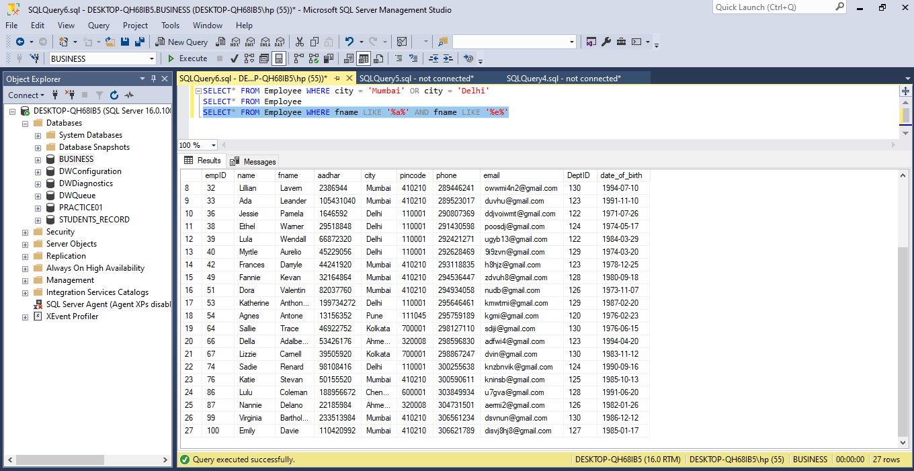

# SQL-TASKS
# TASK1 
•	Create a Database named “Students Record”
•	Create the following tables in the database create
- Students Info  (Student ID, Gender, Name, Age, Subject)
- Health records (Student ID, Blood Group, Height, Weight)
-	Performance (Student ID, Score, Grade)
•	The ID has to be unique
•	Where a student has no score, it should be ‘0’ by default
•	Add a constraint that prevents the ID and Subject from taking null values
•	Apply the following modifications to the table
1.	Change column name ‘’Subject” to ‘’Course” 
2.	Drop the “Age” column from the ‘Students Info’ table
  # SKILL Demonstrated
•	Creating Databases
•	Creating Tables
•	Inserting values into tables
•	Adding constraints to columns in a table
•	Retrieving information using SELECT
•	Altering table structure
 # Brief Discussion
I create the **Database** and **Tables** using the **CREATE FUNCTIONS**. I made the ID unique using the **PRIMARY KEY CONSTRAINT**. On the student’s score column, those without scores were set to indicate ‘0’ with the **DEFAULT CONSTRAINT**. Using the **NOT NULL CONSTRAINT**, student ID, and subject columns were set not to allow null values.  To rename the **‘subject’** column to **‘course’** I use the **rename** option from the column name drop-down. Lastly, to drop the age column from the table, the **ALTER FUNCTION**. These are shown in the  shots below:

# TASK2 
•	Select the employee table and show the data where the city is Mumbai and Delhi. 
•	Select the employee table where the employee's first name has both ‘a and ‘e’  in them. 
•	 Subset the employee table to have employees with a date of birth above 1990
•	Subset the salary table to show salaries less than 1 million and sort in an ascending order
•	Modify the email column of the employee table to contain just email without ‘@gmail.com’
# Skills Demonstrated
Use of WHERE clause
Use of ORDER BY
Use of LIKE
Use of OR
Use of AND
Use of Less than <
Use of greater than >
To answer the first question I **SELECT** all **FROM** the Employee table where the city is **Mumbai OR Delhi**.

And for the next question,  from the **Employee table**, I **SELECTED** the name, **WHERE** the name contains **‘a’ AND ‘e’**. 

Also for the third question, I **SELECTED FROM** the **Employee table** **WHERE date_ of_birth** is greater than **1990-01-01**.

For the last question, I **SELECTED FROM** the **base**, salaries that are less than **10000** and **ORDER BY** base in **ascending (ASC)** order.

# TASK3
1. What is the total number of employees in our employee table??
2. Find out the top 5 cities with the highest number of employees, then filter the result to show cities with more than 15 employees.
3. Find out the most used pin code by the employee. In this case, we want to know the pin codes that are used the most.
  
I got the employees in the table using the **COUNT FUNCTION FROM** the **employee table**.

I calculated the number of employees in each city using the **COUNT FUNCTION** and named the new column ‘Size’, then **GROUP BY** ‘city’ and **ORDER BY** ‘Size’ and thereafter **SELECTED** the **TOP** 5 cities.

For the last question, I **SELECTED** the pincode column from the **employee table** and **COUNTED** the pincode, and named the column **FREQUENCY**, then I **GROUPED BY** pincode and **ORDER BY FREQUENC**Y in descending **(DESC)**  order.

# TASK4
# Introduction
Danny seriously loves Japanese food so at the beginning of 2021, he decides to embark upon a risky venture and opens up a cute little restaurant that sells his 3 favorite foods: **sushi**,  **curry**, and **ramen**.
Danny’s Diner needs your assistance to help the restaurant stay afloat - the restaurant has captured some very basic data from its few months of operation but have no idea how to use their data to help them run the business.
# Problem Statement
Danny wants to use the data to answer a few simple questions about his customers, especially about their visiting patterns, how much money they’ve spent and also which menu items are their favorite. Having this deeper connection with his customers will help him deliver a better and more personalized experience for his loyal customers.
He plans on using these insights to help him decide whether he should expand the existing customer loyalty program - additionally, he needs help to generate some basic datasets so his team can easily inspect the data without needing to use SQL.
Danny has provided you with a sample of his overall customer data due to privacy issues - but he hopes that these examples are enough for you to write fully functioning SQL queries to help him answer his questions!
Danny has shared with you 3 key datasets for this case study:
**members**
**menu**
**sales**
***A View of the Tables**

# Case Study Questions
Each of the following case study questions can be answered using a single SQL statement:
1.	What is the total amount each customer spent at the restaurant?
2.	How many days has each customer visited the restaurant?
3.	What was the first item from the menu purchased by each customer?
4.	What is the most purchased item on the menu and how many times was it purchased by all customers?
5.	Which item was the most popular for each customer?
6.	Which item was purchased first by the customer after they became a member?
7.	Which item was purchased just before the customer became a member?
8.	What are the total items and amount spent for each member before they became a member?
9.	If each $1 spent equates to 10 points and sushi has a 2x points multiplier - how many points would each customer have?
10.	In the first week after a customer joins the program (including their join date) they earn 2x points on all items, not just sushi - how many points do customers A and B have at the end of January?
11.	# Skills Involved
Use of SUM FUNCTION
Use of SELECT (DISTINCT)
Use of SELECT (WHERE) 
Use of AS
Use of ON
Use of JOIN Clause
Use of GROUP BY clause
Use of COUNT Function
Use of SUBQUERY
Use of ORDER BY Statement
Use of RANK
Use of CASE Statement
# DIiscussion of Procedures to Resolve the Problems
To get the total amount each customer spent at the restaurant, I JOIN the sales table with the menu table, SUM the price column, name it AS Total¬ Amount, and SELECT DISTINCTly.
The next question is to get the number of days each customer visited the restaurant. I did a DISTINCT COUNT of the order date and named the new column No. of Days, GROUP IT BY customer id, and SELECT the customer id.
I found the first item each customer purchased from the menu by JOINING the sales and menu tables WHERE the order date is equal to the customer’s first day of visiting the restaurant (2021-01-01)  and then SELECTED all columns. 
  Also, the most purchased item on the menu and the number of times all customers purchased it was calculated thus: I joined the sales and menu tables, COUNTED  the names of each purchased product, SELECTED the product name, and filtered by same product name and sort in ASCENDING (ASC) order.
 To get the most purchased product by each customer, I JOINED the sales and menu tables, COUNTED the customer id and named it unit and then I SELECTED customer id and product name filter by same columns and sorted by customer id in ASCENDING (ASC) order.
I found the first item purchased by the customers after they became a member by JOINING the three tables; sales, menu, and members tables. Then I RANKED the customer id column, ORDERED by join date column and name it FIRST PRODUCT. After which I SELECTED customer id, join date, and product name, and GROUPED BY the same columns.
#  Visaul Display of the Procedure For Questions 1 to 6

I found the item purchased by the customers just because they became members by JOINIG the sales and members tables. I used the WHERE clause to restrict the order date to dates that were less than or equal to 2021-01-09 which is when the last member joined. Then I SELECT customer id, product name, order date and SORTED BY order date.
 I obtained the total item and amount spent by each customer before they became members by JOINING the three tables again and used the WHERE clause to restrict the order date to exclude the first membership date of 2021-01-07. Then I SUMMED UP the price and named it as Total Amount, COUNTED, and SELECTED the customer id. Thereafter, I  FILTERED BY customer id.
To calculate each customer’s point given the condition, I JOINED the sales and menu tables and GROUP BY product name,  multiplied the prices WHEN the product name is ‘SUSHI’  and WHEN it wasn’t using the CASE FUNCTION and named the column POINTS OBTAINED. Then I SUMMED the POINTS OBTAINED, SELECTED customer id, and GROUPED BY the same column.
For the last question, I got the points of both customers by JOINING the sales and menu tables, using a CASE statement to restrict the order date to less than or equal to ‘2021-01-07’ which is the earliest membership date, and then multiplicated the price by *20 ELSE multiply the price by *1 which will ensure the un referenced prices maintain their values and name the new column POINTS. I SUMMED UP the points and named them MONTHLY POINTS and filtered them by customer id. 
#  Visaul Display of the Procedure For Questions 7 to 10

